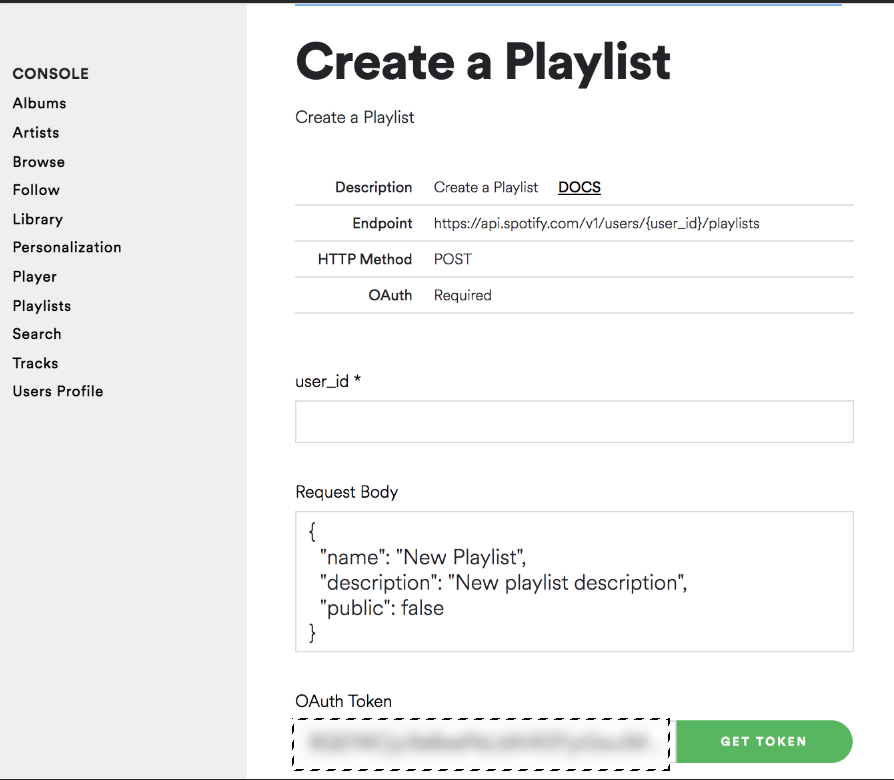

# AutomationSpotify
A  script that takes your liked videos on Youtube, and generates a Spotify playlist based on the song in your liked videos.

## Table of Contents
* [Website](#Website)
* [Technologies](#Technologies)
* [Setup](#LocalSetup)
* [ToDo](#ToDo)
* [Credits](#Credits)

## Website
Check out the my Website for a step by step walk through 
[My Website]

## Technologies
* [Youtube Data API v3]
* [Spotify Web API]
* [Requests Library v 2.22.0]

## LocalSetup
1) Install All Dependencies   
`pip install -r requirements.txt`

2) Collect You Spotify User ID and Oauth Token From Spotfiy and add it to secrets.py file
    * To Collect your User ID, Log into Spotify then go here: [Account Overview] and its your **Username**
    
    * To Collect your Oauth Token, Visit this url here: [Get Oauth] and click the **Get Token** button
    

3) Enable Oauth For Youtube and download the client_secrets.json   
    * Ok this part is tricky but its worth it! Just follow the guide here [Set Up Youtube Oauth] ! 
    If you are having issues check this out [Oauth Setup 2] and this one too [Oauth Setup 3] 

4) Run the File  
`python3 create_playlist.py`   
    * you'll immediately see `Please visit this URL to authorize this application: <some long url>`
    * click on it and log into your Google Account to collect the `authorization code`

## ToDo
* Create a Graphical Interface
* Create a mobile app with Kivy

## Credits
Credits to [The Come Up] channel for Start a ideia and share yours code.
Know my [Website] and more about my in my [LinkedIn] profile.

   [Youtube Data API v3]: <https://developers.google.com/youtube/v3>
   [Spotify Web API]: <https://developer.spotify.com/documentation/web-api/>
   [Requests Library v 2.22.0]: <https://requests.readthedocs.io/en/master/>
   [Account Overview]: <https://www.spotify.com/us/account/overview/>
   [Get Oauth]: <https://developer.spotify.com/console/post-playlists/>
   [Set Up Youtube Oauth]: <https://developers.google.com/youtube/v3/getting-started/>
   [Oauth Setup 2]:<https://stackoverflow.com/questions/11485271/google-oauth-2-authorization-error-redirect-uri-mismatch/>
   [Youtube Video]:<https://www.youtube.com/watch?v=7J_qcttfnJA/>
   [Youtube_dl v 2020.01.24]:<https://github.com/ytdl-org/youtube-dl/>
   [Oauth Setup 3]:<https://github.com/googleapis/google-api-python-client/blob/master/docs/client-secrets.md/>
   [The Come Up]:<https://www.youtube.com/watch?v=7J_qcttfnJA>
   [LinkedIn]:<https://www.linkedin.com/in/matheus-terra/>
   [Website]:<https://matheusterra.com>